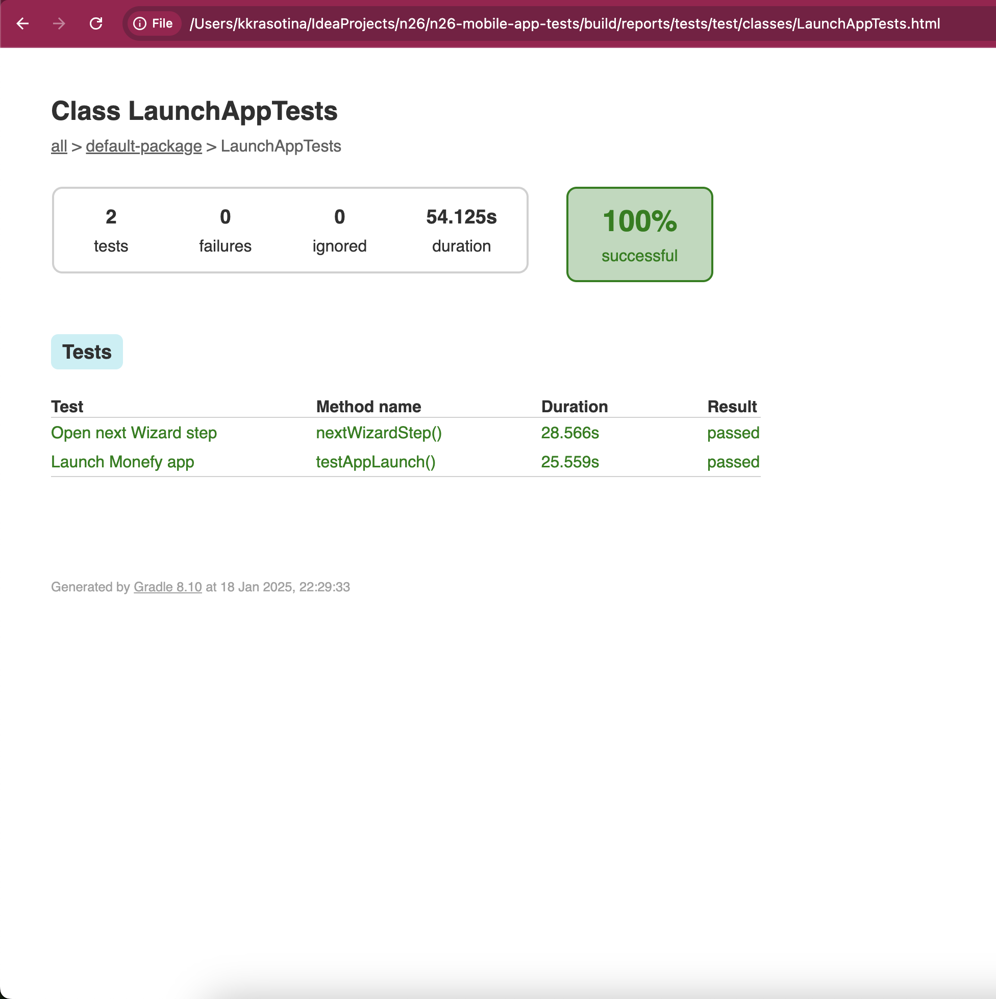

# Solution Explanation

## Prerequisites

Before running the tests, ensure the following are installed on your system:

- **Java**
- **Gradle**
- **Appium**
- **Android Emulator**

## Setup

Please follow these steps to set up the project:

1. **Clone the repository:**
   ```bash
   git clone https://github.com/KseniaKrasotina/n26-mobile-app-tests.git
   cd n26-mobile-app-tests
   ```

2. **Install dependencies:**
   Ensure you have [Java JDK](https://www.oracle.com/java/technologies/javase-downloads.html) installed. Then, build the project using Gradle:
   ```bash
   ./gradlew clean build
   ```

3. **Install Appium:**
   Install Appium from official Website [Appium](https://appium.io/docs/en/2.15/quickstart/install/)

4. **Start Appium server:**
   Start the Appium server before running the tests:
   ```bash
   appium
   ```

5. **Prepare an Android Emulator**
    - Ensure an Android Emulator or physical device is running and connected.

## How to Run Tests on a Local Machine

To run the tests, please, do the following:

1. **Run tests locally with `run_tests.sh`:**
   I've implemented a `run_tests.sh` script located in the root directory:
   ```bash
   ./run_tests.sh
   ```
   This script will:
    - Start the Appium server
    - Execute the test suite

2. **View Test Reports:**
   After running the tests, reports will be generated in the following directory:
   ```
   build/reports/tests/test/index.html
   ```
   Open the `index.html` file in a browser to view detailed test results

## Tech Stack and Explanation

### Tech Stack

1. **Java and JUnit:**
    - Java offers libraries for mobile testing
    - JUnit offers powerful testing features and annotations for structuring test cases

2. **Appium:**
    - A cross-platform mobile testing tool used to automate Android applications

3. **Gradle:**
    - Used for dependency management and build automation

4. **HTML Reports:**
    - Gradle generates test report

5. **Shell Script (`run_tests.sh`):**
- Automates the testing process by starting the Appium server and running the test suite.

## Report Screenshot


